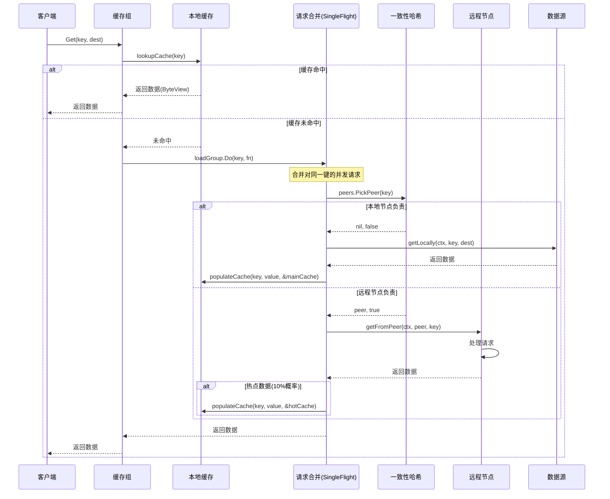
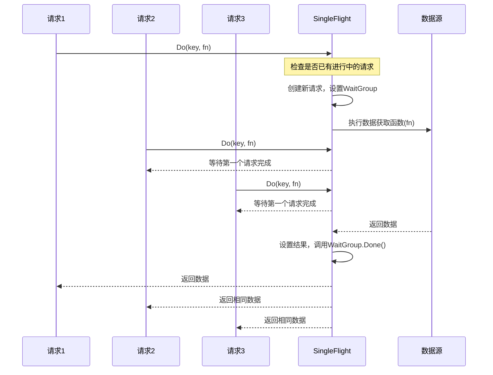
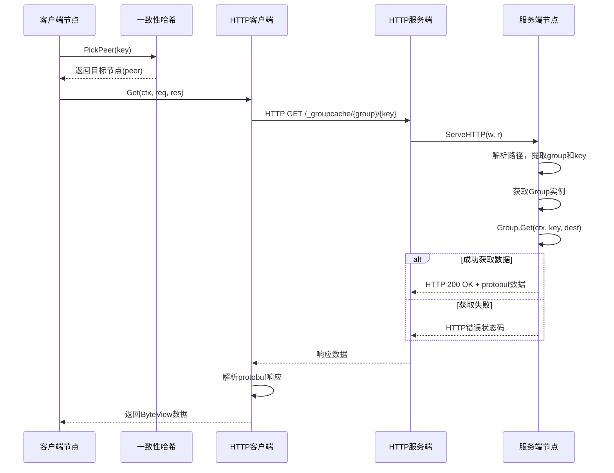
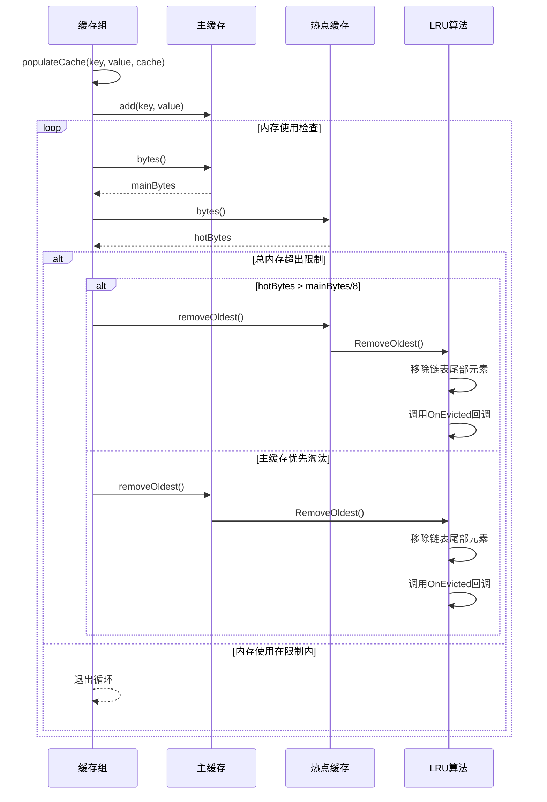
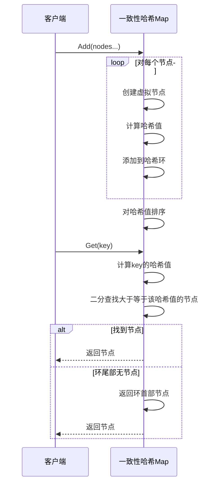
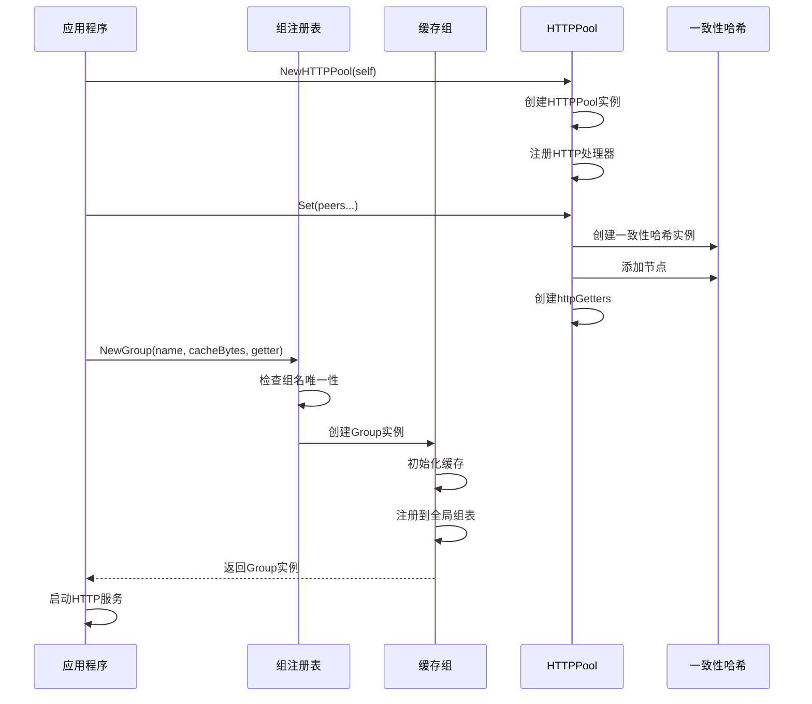

# 轻量级嵌入式分布式缓存系统时序图

## 1. 缓存获取流程时序图

```mermaid
sequenceDiagram
    participant Client as 客户端
    participant Group as 缓存组
    participant LocalCache as 本地缓存
    participant SF as 请求合并(SingleFlight)
    participant CH as 一致性哈希
    participant RemoteNode as 远程节点
    participant DataSource as 数据源

    Client->>Group: Get(key, dest)
    Group->>LocalCache: lookupCache(key)
    
    alt 缓存命中
        LocalCache-->>Group: 返回数据(ByteView)
        Group-->>Client: 返回数据
    else 缓存未命中
        LocalCache-->>Group: 未命中
        Group->>SF: loadGroup.Do(key, fn)
        
        note over SF: 合并对同一键的并发请求
        
        SF->>CH: peers.PickPeer(key)
        
        alt 本地节点负责
            CH-->>SF: nil, false
            SF->>DataSource: getLocally(ctx, key, dest)
            DataSource-->>SF: 返回数据
            SF->>LocalCache: populateCache(key, value, &mainCache)
        else 远程节点负责
            CH-->>SF: peer, true
            SF->>RemoteNode: getFromPeer(ctx, peer, key)
            RemoteNode->>RemoteNode: 处理请求
            RemoteNode-->>SF: 返回数据
            
            alt 热点数据(10%概率)
                SF->>LocalCache: populateCache(key, value, &hotCache)
            end
        end
        
        SF-->>Group: 返回数据
        Group-->>Client: 返回数据
    end
```

## 2. 请求合并机制时序图

```mermaid
sequenceDiagram
    participant R1 as 请求1
    participant R2 as 请求2
    participant R3 as 请求3
    participant SF as SingleFlight
    participant DS as 数据源

    R1->>SF: Do(key, fn)
    
    note over SF: 检查是否已有进行中的请求
    
    SF->>SF: 创建新请求，设置WaitGroup
    SF->>DS: 执行数据获取函数(fn)
    
    R2->>SF: Do(key, fn)
    SF-->>R2: 等待第一个请求完成
    
    R3->>SF: Do(key, fn)
    SF-->>R3: 等待第一个请求完成
    
    DS-->>SF: 返回数据
    SF->>SF: 设置结果，调用WaitGroup.Done()
    
    SF-->>R1: 返回数据
    SF-->>R2: 返回相同数据
    SF-->>R3: 返回相同数据
```

## 3. 节点间HTTP通信时序图

```mermaid
sequenceDiagram
    participant CN as 客户端节点
    participant CH as 一致性哈希
    participant HC as HTTP客户端
    participant HS as HTTP服务端
    participant SN as 服务端节点
    
    CN->>CH: PickPeer(key)
    CH-->>CN: 返回目标节点(peer)
    
    CN->>HC: Get(ctx, req, res)
    
    HC->>HS: HTTP GET /_groupcache/{group}/{key}
    
    HS->>SN: ServeHTTP(w, r)
    SN->>SN: 解析路径，提取group和key
    SN->>SN: 获取Group实例
    SN->>SN: Group.Get(ctx, key, dest)
    
    alt 成功获取数据
        SN-->>HS: HTTP 200 OK + protobuf数据
    else 获取失败
        SN-->>HS: HTTP错误状态码
    end
    
    HS-->>HC: 响应数据
    HC->>HC: 解析protobuf响应
    HC-->>CN: 返回ByteView数据
```

## 4. 数据淘汰流程时序图

```mermaid
sequenceDiagram
    participant Group as 缓存组
    participant MainCache as 主缓存
    participant HotCache as 热点缓存
    participant LRU as LRU算法
    
    Group->>Group: populateCache(key, value, cache)
    Group->>MainCache: add(key, value)
    
    loop 内存使用检查
        Group->>MainCache: bytes()
        MainCache-->>Group: mainBytes
        
        Group->>HotCache: bytes()
        HotCache-->>Group: hotBytes
        
        alt 总内存超出限制
            alt hotBytes > mainBytes/8
                Group->>HotCache: removeOldest()
                HotCache->>LRU: RemoveOldest()
                LRU->>LRU: 移除链表尾部元素
                LRU->>LRU: 调用OnEvicted回调
            else 主缓存优先淘汰
                Group->>MainCache: removeOldest()
                MainCache->>LRU: RemoveOldest()
                LRU->>LRU: 移除链表尾部元素
                LRU->>LRU: 调用OnEvicted回调
            end
        else 内存使用在限制内
            Group-->>Group: 退出循环
        end
    end
```

## 5. 一致性哈希节点选择时序图

```mermaid
sequenceDiagram
    participant Client as 客户端
    participant Map as 一致性哈希Map
    
    Client->>Map: Add(nodes...)
    
    loop 对每个节点
        Map->>Map: 创建虚拟节点
        Map->>Map: 计算哈希值
        Map->>Map: 添加到哈希环
    end
    
    Map->>Map: 对哈希值排序
    
    Client->>Map: Get(key)
    Map->>Map: 计算key的哈希值
    Map->>Map: 二分查找大于等于该哈希值的节点
    
    alt 找到节点
        Map-->>Client: 返回节点
    else 环尾部无节点
        Map->>Map: 返回环首部节点
        Map-->>Client: 返回节点
    end
```

## 6. 系统初始化流程时序图

```mermaid
sequenceDiagram
    participant App as 应用程序
    participant Registry as 组注册表
    participant Group as 缓存组
    participant HTTP as HTTPPool
    participant CH as 一致性哈希
    
    App->>HTTP: NewHTTPPool(self)
    HTTP->>HTTP: 创建HTTPPool实例
    HTTP->>HTTP: 注册HTTP处理器
    
    App->>HTTP: Set(peers...)
    HTTP->>CH: 创建一致性哈希实例
    HTTP->>CH: 添加节点
    HTTP->>HTTP: 创建httpGetters
    
    App->>Registry: NewGroup(name, cacheBytes, getter)
    Registry->>Registry: 检查组名唯一性
    Registry->>Group: 创建Group实例
    Group->>Group: 初始化缓存
    
    Group->>Group: 注册到全局组表
    Group-->>App: 返回Group实例
    
    App->>App: 启动HTTP服务
``` 